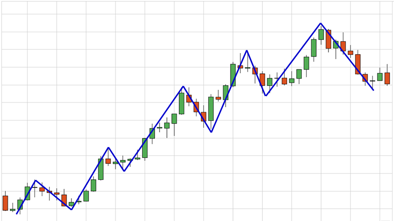

# 🚀 Cloudflare Worker Telegram Bot

[](https://t.me/x_Jonah)  [](https://workers.cloudflare.com/)  [](https://nodejs.org/)  [](https://www.coingecko.com/)  [](https://binance.com)  [](LICENSE)

A **serverless Telegram bot** built with **Cloudflare Workers** that provides real-time cryptocurrency data, Binance P2P trading rates, and CoinGecko market insights — all directly inside Telegram.

## 🏗️ Architecture

This bot uses a **hybrid architecture** to ensure compatibility with Cloudflare Workers:

- **Frontend (Cloudflare Workers)**: Handles Telegram webhooks, command routing, and user interactions. Maintains compatibility with the Cloudflare Workers runtime by avoiding Node.js-specific modules.

- **Backend (Node.js Server)**: Deployed on Render, handles chart generation, data processing, and any Node.js-specific functionality. Provides REST API endpoints for the frontend.

- **Communication**: Frontend makes HTTP requests to backend API endpoints when needed, ensuring clean separation of concerns.

### API Endpoints (Backend)
- `GET /api/chart` - Generate price charts
- `GET /api/candlestick-chart` - Generate candlestick charts  
- `GET /api/comparison-chart` - Generate comparison charts
- `POST /binancep2p` - Proxy Binance P2P requests
- `GET /health` - Health check


## ✨ Features

- 📊 **Real-time Binance P2P Data**  
  Get live buy/sell offers for popular crypto assets like **USDT, BTC, ETH, BNB** in multiple fiat currencies (ETB, USD, EUR, GBP, NGN, KES, GHS).

- 💱 **Currency Conversion**  
  Convert between crypto ↔ crypto or crypto ↔ fiat with live market data.

- 🪙 **Coin Information**  
  Fetch detailed coin data (price, volume, market cap, supply) with **auto-generated price charts**.

- 💰 **Sell Estimator**  
  Quickly calculate how much ETB you’ll get when selling crypto.

- ⚡ **Rate Limiting & Caching**  
  Prevents abuse and improves performance with smart caching.

- 🖼 **Charts & Images**  
  Generates clean, responsive price charts using [QuickChart.io](https://quickchart.io/).

---

## 🛠️ Commands

| Command | Description | Example |
|---------|-------------|---------|
| `/start` or `/help` | Show welcome message and list of commands | `/start` |
| `/p2p [asset] [fiat] [type]` | Get Binance P2P rates | `/p2p USDT ETB BUY` |
| `/rate [amount] [currency] [vsCurrency]` | Convert with live rates | `/rate 100 BTC USD` |
| `/sell [amount]` | Estimate ETB for selling crypto | `/sell 50` |
| `/convert [amount] [from] [to]` | Convert between any currencies | `/convert 100 ETH ADA` |
| `/coin [symbol]` | Get detailed market info with chart | `/coin bitcoin` |

---

## 📂 Project Structure

```
├── src/                     # Frontend (Cloudflare Workers)
│   ├── utils/              # Utility functions (formatting, escaping, etc.)
│   ├── cache/              # Caching & rate-limiting helpers  
│   ├── api/                # API wrappers and proxies to backend
│   ├── commands/           # Telegram command handlers
│   ├── config/             # Configuration constants
│   └── worker.js           # Main Cloudflare Worker entry
├── backend/                # Backend (Node.js Server)
│   ├── server.js           # Express server with API endpoints
│   ├── charts.js           # Chart generation using QuickChart.io
│   └── package.json        # Backend dependencies
├── wrangler.toml           # Cloudflare Worker config
├── package.json            # Frontend dependencies  
└── README.md
```

---

## ⚙️ Environment Variables

Set these in your Cloudflare Worker environment:

| Variable | Description |
|----------|-------------|
| `TELEGRAM_BOT_TOKEN` | Your Telegram bot token from [BotFather](https://t.me/BotFather) |
| `BOT_CACHE` | Cloudflare KV namespace binding for caching API responses |

---

````

## 🚀 Deployment

### Backend Deployment (Node.js Server)

1. **Deploy to Render** (or your preferred Node.js hosting service)
   ```bash
   # Navigate to backend directory
   cd backend/
   
   # Install dependencies
   npm install
   
   # Start server (for testing)
   npm start
   ```

2. **Configure Environment Variables** on Render:
   - Set `PORT` to the port provided by Render (usually automatic)
   - The backend will be accessible at your Render URL (e.g., `https://my-telegram-bot-backend.onrender.com`)

### Frontend Deployment (Cloudflare Workers)

1. **Clone the repo**
   ```bash
   git clone https://github.com/YonasGr/my-telegram-bot.git
   cd my-telegram-bot
   ```

2. **Install dependencies**
   ```bash
   npm install
   ```

3. **Update Backend URL** in `src/config/constants.js`:
   ```javascript
   export const API_URLS = {
     BACKEND_BASE: 'https://your-backend-url.onrender.com',
     // ... other URLs
   };
   ```

4. **Configure Wrangler**
   ```bash
   wrangler login
   wrangler kv:namespace create BOT_CACHE
   ```

5. **Deploy**
   ```bash
   wrangler deploy
   ```

6. **Set Telegram Webhook**
   ```bash
   curl -X POST "https://api.telegram.org/bot<YOUR_BOT_TOKEN>/setWebhook" \
        -d "url=https://<your-worker-subdomain>.workers.dev"
   ```
````

## 📸 Example

**Coin Command Response**

```
🪙 Bitcoin (BTC)

💰 Price: $42,000.00
📈 24h Change: 🟢 +3.2%
🏆 Market Cap Rank: #1
📊 Market Stats:
• Market Cap: $820B
• 24h Volume: $25B
• Circulating Supply: 19M BTC
```



---

## 📌 Notes

* Binance P2P requests are proxied through a backend to bypass Cloudflare Worker restrictions.
* CoinGecko API has strict **rate limits** → caching is implemented to prevent errors.
* Charts are generated dynamically via **QuickChart.io**.

---

## 👨‍💻 Author

Built by [@x\_Jonah](https://t.me/x_Jonah)
📢 Updates: [@Jonah\_Notice](https://t.me/Jonah_Notice)

---
